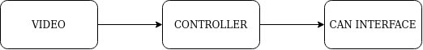
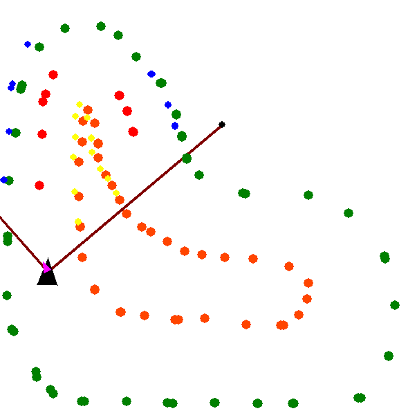

# História

Os carros autônomos passaram a fazer parte da Formula SAE em 2017, primeiramente na Alemanha, com uma nova categoria da competição dedicada a eles. Explorando a expertise que a Unicamp E-Racing já possuía, as ideias de se incluir nesse novo espaço já estavam surgindo.

Depois de mais uma vitória no campeonato nacional, em 2018, a Unicamp E-Racing se reuniu para estruturar as novas metas para o próximo ano. Nesse contexto, querendo levar o desenvolvimento das tecnologias da equipe para o patamar autônomo, quatro membros com grande ambição fundaram a Inteligência Artificial para criar o primeiro Fórmula SAE Driverless das Américas.

Dois meses depois e um total de 12 membros incorporados, a divisão já possuía um roadmap completo para viabilizar esse desafio e iniciou seus trabalhos.

Esse projeto, agora aberto ao publico é uma versão polida, contendo codigos e documentação das lições aprendidas durante essa fase inicial de estudos, que consistiu nos 6 primeiros meses de 2019 - No qual a equipe conseguiu fazer um primeiro protótipo funcional. 

# Resultados

[](https://youtu.be/QOEYtYBCpx0)


[](https://youtu.be/7U0QbVUJCPA)

# Objetivos e Filosofias

Por mais que existam metodos de mapeamento e controle sofisticados, optou-se em primeiro momento por adotar a ideia mais simples possivel, para poder assim entender quais areas precisariam de maior complexidade e estudo; o objetivo foi ter um protótipo funcional mais rapido possivel.

Algumas filosofias seguidas no desenvolvimento desse Software;

- [KISS](https://en.wikipedia.org/wiki/KISS_principle)
- Minimalist Code

# O Desafio


Desenvolver um carro de Fórmula SAE autônomo, capaz de percorrer de forma segura e com alto desempenho uma pista delimitada por cones em ambos os lados.

# O Hardware

- Jetson TX2


- ZED Camera


# O Software

## Resumo

Seguindo a filosofia e objetivos citados anteriomente, o software segue uma lógica bem simples que consiste na seguinte linha de processamento:



### Video

Processamento de imagem e detecção dos cones;

### Controller

Determinação do meio da pista e Target de steering;

### Can Interface

Comunicação com o carro;

## Bibliotecas Utilizadas
- [OPENCV](https://github.com/opencv/opencv)
- [ZED SDK](https://github.com/stereolabs/zed-python-api)
- [YOLO34Py](https://github.com/madhawav/YOLO3-4-Py)
- [FSDVIEWER](https://github.com/jpvolt/fsdviewer)

## Interfaces

### Interface com o carro

A interface com o carro é feita exclusivamente pela CAN bus, na qual o carro envia informaçoes como velocidade e recebe comandos como Target de Steering.

A interface com a CAN foi feita através de um adaptador USB-CAN


### Interface com a câmera

A Camera utilizada possui uma interface USB3.0, que era conectada diretamente a placa de processamento central(Jetson TX2);

## Opções de operação

Uma das principais funcionalidades do software é a operação em diferentes modos, podendo ser tirar certos componentes e simula-los separadamente, facilitando assim a otimização de parametros e a procura de erros.

### Vision Simulation

Nesse modo, toda pipeline de visão, é substituida por uma emulação utilizando um arquivo de pista, simulando assim a detecção dos cones. Tem grande utilidade para testar diferentes estratégias de controle.

### Car Simulation

Utilizada para simular o comportamento do carro, utilizando um modelo cinematico simples ( modelo de bicicleta);  A comunicação com essa simulação é feita atraves de uma CAN virtual, assim o restante do comportamento do software permanece inalterado. 

### Can read

Com essa opção ativada, o software além de escrever, lê informações do barramento CAN, utilizado principalmente para debug, uma vez que as informaçoes lidas não eram utilizadas para o controle do carro.

# Arquivo de constantes

Todas as constantes utilizadas estão concentradas em um unico arquivo (constants.py); Essas constantes mudam de diversas formas a operação do software; As principais constantes serão explicadas abaixo:

```python
SHOW_IMG = False  # Mostra janela com imagem da camera e cones detectados
SHOW_VIEWER = True  # Mostra vizualisador topdown com cones e carro.
RUN_FLAGS = ["CAN_READ", "CAR_SIMULATION", "VISION_SIMULATION"] # opçoes de operação
...
CAPTURE_MODE = "ZED_SDK"  # ZED_SDK or OPENCV Modo de captura da imagem da camera
FLIP_IMG = False  # inverte a imagem da camera se a camera foi montada de ponta cabeça
...
MESURMENT_MODE = "STEREO"  # STEREO or MONO - Modo de medição da posição do cone
...
```

# Video

Bloco responsável por capturar a imagem da camera, detectar os cones na imagem e determinar a posição dos cones.

## Modos de operação

### Captura

Possui dois modos de captura, utilizado o SDK da camera ZED, ou utilizado a biblioteca OPENCV, sendo o segundo metodo utilizado em testes utilizado diferentes cameras.

### Detecção

Possui apenas um metodo de detecção, utilizado a rede neural YOLO

### Medição

Possui 2 modos de medição da posição dos cones. sendo eles

- Mono

    Utilizando informações prévias do tamanho do cone, utiliza-se a altura do cone na imagem para estimar sua distancia. é relativamente preciso para cones proximos.

- Stereo

    Utilizando a imagem stereo da camera, calcula a posição 3d do cone em relação a camera

# Controller

Duas diferentes logicas de controle foram utilizada e testadas. Todas elas buscam encontrar o meio da pista e em seguida determinar o angulo de esterçamento para manter o carro no meio da pista.

Diversas constantes mudam drasticamente o comportamento do Controlador, tais constantes determinam limites e parametros que devem ser otimizados dependendo da pista e do carro.

## Controller 1

Metodo simples, basicamente calcula a media da posição dos cones mais proximos do carro, fazendo checagens de colisão.

## Controller 2

Por meio de um algoritimo simples, encontra os pares de cones (azul + amarelo) e a partir deles computa o meio da pista.

# CAN Interface

Interface CAN, envia e recebe mensagens na bus CAN do carro, tendo como principal papel codificar e decodificar essas mensagens. 

Esse bloco de codigo deve ser customizado dependendo da aplicação, podendo ser até mesmo totalmente substituido por outras formas de interface.

# Car Emulator

Codigo auxiliar, que emula o carro utilizando um modelo cinematico de bicicleta, além de emular as mensagens CAN e o atuador de steering.


A simulação do tempo de resposta do atuador de steering permitiu a detecção de alguns problemas, que serão discutidos na seção seguinte.

# Vision Emulator

Esse código auxilar simula a pipeline Video, utilizando um arquivo de contendo pontos [x,y] dos cones, há a implementação de erro de medida assim como falha(dropout).


# Viewer

Código auxiliar utilizado para desenhar informações do estado atual do carro na tela, nele é possível visualizar a posição dos cones em relação ao carro.



Utilizado em conjuto com o Car Emulator e Vision Emulator

# Problemas e possiveis melhorias

## Tempo de resposta do atuador

O tempo de resposta do atuador, que não foi levado em consideração no software, impossibilita o aumento da velocidade de navegação;

## Velocidade de detecção

Outros metodos de deteção dos cones na imagem podem ser implementados para melhorar a latência do sistema;

## Mapeamento

Desenvolver algoritimos de mapeamento, permitindo assim tomadas de decisões com uma janela de tempo maior;

## Controle de velocidade

Desenvolver controle de velocidade do carro, em busca de melhores tempos de volta;
